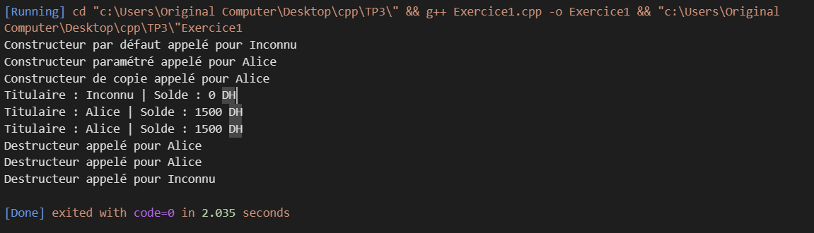
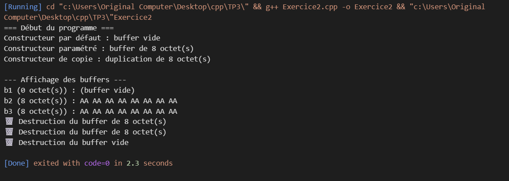

# TP3 : Constructeurs et Destructeurs en C++

## Exercice 1 : Gestion d'un Compte Bancaire
**Objectif :** Mettre en œuvre différents types de constructeurs et un destructeur dans une classe représentant un compte bancaire.

### Exemple d’exécution :

---

## Exercice 2 : Gestion d’un Buffer Dynamique
**Objectif :** Apprendre à gérer l’allocation et la libération de mémoire dans une classe C++, en implémentant :

- un constructeur par défaut  
- un constructeur paramétré (taille du buffer)  
- un constructeur de copie (copie profonde)  
- un destructeur correctement écrit

### Exemple d’exécution :

